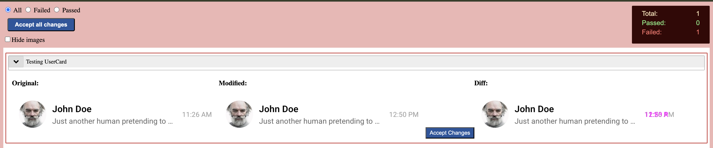
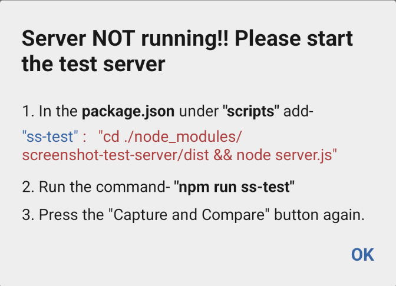
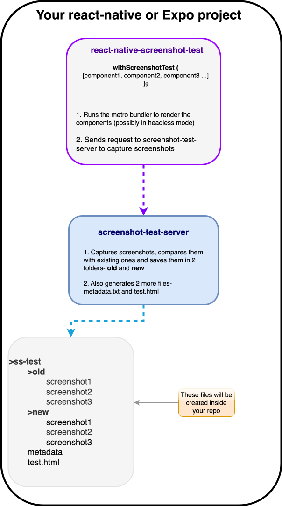

## react-native-screenshot-test

**The most straightforward screenshot testing library for react-native.** <br/><br/>
It lets you compare current UI elements with their previous state at the **pixel** level. With minimal setup and no extra effort for writing tests, it generates a test report showing the prior and current states and a diff image. It works with both Expo and bare React Native. <br/>

## Why screenshot-test?

Snapshot tests are cool… until they aren’t.<br />
They compare code. Screenshot-test compares what actually matters - real screenshots from real devices. <br />
With snapshots, let’s be honest… half the time you see a failure and go:
> "eh, probably fine" → update snapshot

You're tempted to just update the snapshots instead of actually investigating what changed. <br />
With screenshots, that temptation is reduced. You can’t skip images showing the `diff` highlighted in  $${\color{red}brick-red}$$



[Visit a sample test report](https://abhinandan-kushwaha.github.io/TestingCharts/ss-test/test.html) of `react-native-gifted-charts`

---

**Note:** This package works on Node versions 22 and above.

## 1. HeadLess mode
Can be used in Expo or react-native projects that can render on web (possibly using react-native-web). Your project will run in headless (no UI) mode and the server will capture screenshots.

Just wrap your UI component/widget inside `withScreenshotTest`. Then run the screenshot-test server. The tests will run and a report will be generated in `test.html` file.

### Installation

```
npm i react-native-screenshot-test
```

---

## 2. Simulator/Device mode

Just wrap your UI component/widget inside `withScreenshotTest` and render it on your emulator/device.

The emulator will render your component/widget along with a button named <b>Capture and Compare</b>

Hit the button and the tests will run and a report will be generated in `test.html` file.

### Installation

```
sudo npm i react-native-screenshot-test react-native-view-shot react-native-fs
```

use `sudo` because internally we have a command to set up chrome puppeteer which might needs permissions.

Rebuild and relaunch your app after installation.

---

### Usage

1. In your project's `package.json`, under <i>scripts</i>, add-

```js
"scripts": {
    ...
    ...
    "ss-test": "(npx expo start -c & sleep 2) && cd ./node_modules/screenshot-test-server/dist && node server.js true", // add this for headless mode

    // OR
    // to run the tests on simulator/device (in non-headless mode), add below line

    "ss-test": "cd ./node_modules/screenshot-test-server/dist && node server.js false" // add this for simulator/ device mode
}
```

2. Write your tests. Below is a sample test-

```js
import Component1 from '/path-to-component-1';
import Component2 from '/path-to-component-2';
import { withScreenShotTest } from 'react-native-screenshot-test';

const App = () => {

    const testComponents = [
        {
            component: Component1,
            title: 'Component 1 details to be observed',
            id: 'c1',
        },
        {
            component: Component2,
            title: 'Component 2 details to be observed',
            id: 'c2',
        },
        ...
    ];

    const screenshotConfig = {
        /* properties path, localhostUrl, port, quality etc (all optional) */
    };

    const isHeadless = true / false

    return withScreenShotTest(testComponents, isHeadless, screenshotConfig);
}

```

3. In your projects root directory, run the below command(s)-

```js
npm run ss-test
```
This will start the test server.

4. Render your test component in your simulator or device and press the <i>"Capture and Compare"</i> button. This step is needed only if you have NOT chosen the headless mode.

5. This will generate a folder named `ss-test` (or the path you provided in config) in your project's root directory.

6. Navigate to <i>ss-test</i> or <i> (or the path you provided in config)</i> folder  and open the file named `test.html` in your browser.

### Props

`withScreenShotTest` receives 3 parameters- Components array, isHeadless and ScreenshotConfig.

#### ScreenshotConfig is defined as-

```ts
interface ScreenshotConfig {
  path?: string; // path where screenshots should be saved, default: ss-test
  serverUrl?: string; // for web & iOS emulator it is http://127.0.0.1:8080, for Android emulator it is http://10.0.2.2:8080
  batchSize?: number; // number of tests to be processed at a time, default: 10
  maxWidth?: number; // maxWidth to be used in html while rendering the captured screenshot, default: 500
  backgroundColor?: string; // backgroundColor to be used in html while rendering the captured screenshot, default: transparent
  showDiffInGrayScale?: boolean; // show diff image in grayScale? default: false
  quality?: number; // quality (0 to 1) while capturing the screenshot, default: 0.9
}
```
<b>Note:</b> all these properties are optional. In fact the second parameter to `withScreenShotTest` is entirely optional. When omitted, the library assigns the default values to each property.

#### Components is an array where each item of the array has following properties-

```ts
interface Components {
  component: (props?: any) => ReactElement;
  title: string;
  id: string;
  description?: string;
  showDiffInGrayScale?: boolean;
  maxWidth?: number;
  backgroundColor?: string;
  quality?: number; // NOT used in headless mode
}
```
<b>Note:</b> only the first 3 properties- `component`, `title` and `id` are required, rest are optional. 

## Frequent Issues




If you encounter the error saying- "Server NOT running!!" like above 👆 just follow the steps given along with the error message. <br />
If you still get the same issue, the reason might be the `serverUrl`.<br />
The default serverUrl is set to `http://127.0.0.1:8080`.<br />
Just pass correct the `serverUrl` in the `screenshotConfig`. <br />
You can get your network address (on Mac) using-
```
ipconfig getifaddr en0
```
It gives something like `192.168.0.5`. Use this address in the serverUrl, making something like- `http://192.168.0.5:8080`.
**Example**
```js
const screenshotConfig = {
    serverUrl: "http://192.168.0.5:8080",
    ...
}
```

---

## Architecture



The test report is saved in `test.html` file inside a folder named `ss-test`

**Note:** <br/> The screenshot creation, updation and test report generation is handled using **[screenshot-test-server](https://github.com/Abhinandan-Kushwaha/screenshot-test-server)**
